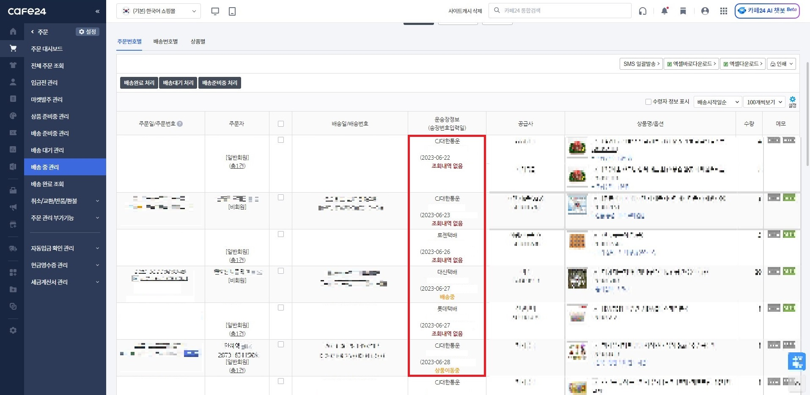

# Cafe24 배송상태 확인 스크립트
Cafe24 Admin > 주문 > 배송 중 관리'에서 배송 상태를 확인하여 보여주는 확장 스크립트 입니다.

## Features

- 배송 상황 자동 조회
- 배송완료된 주문건은 자동으로 체크

## Installation
  
1. Chrome 확장프로그램 [Tampermonkey](https://chrome.google.com/webstore/detail/tampermonkey/dhdgffkkebhmkfjojejmpbldmpobfkfo) 를 설치합니다.
2. [Cafe24_AutoDeliveryCheck.user.js](https://github.com/bsy0317/Cafe24-Delivery-Tracking/raw/main/Cafe24_AutoDeliveryCheck.user.js)를 설치합니다.
3. 자동으로 설치되지 않는 경우 [Cafe24_AutoDeliveryCheck.user.js](Cafe24_AutoDeliveryCheck.user.js)의 내용을 확장프로그램에 붙여넣습니다.

## Tip

- 자체배송 발송 건은 조회되지 않도록 검색조건 설정이 필요합니다.
- '배송 중 관리' 페이지 상단 검색조건에서 '배송업체' 칸의 자체배송은 해제한후 검색 조건 저장을 하시면 됩니다.

## Screenshots

## Support

For support, email talk@kakao.one

